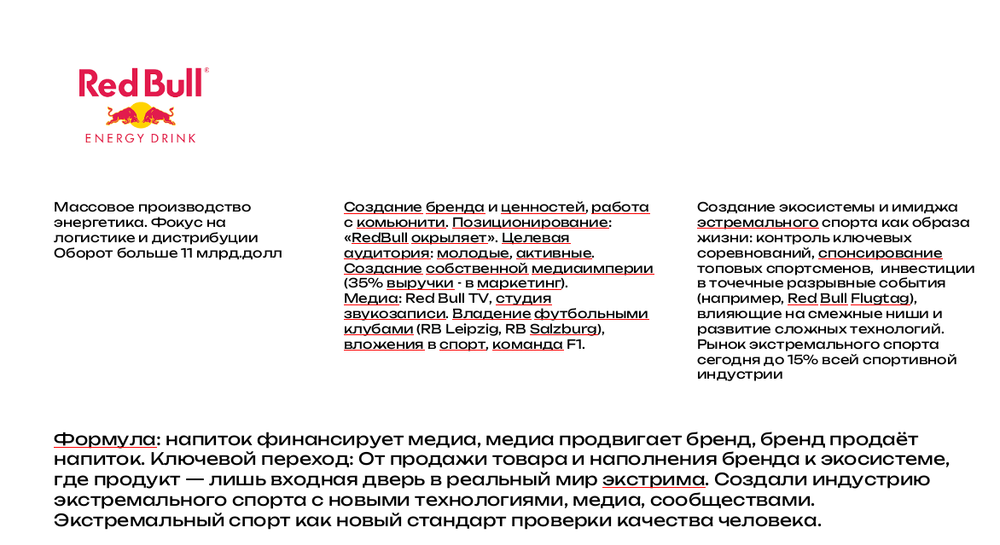
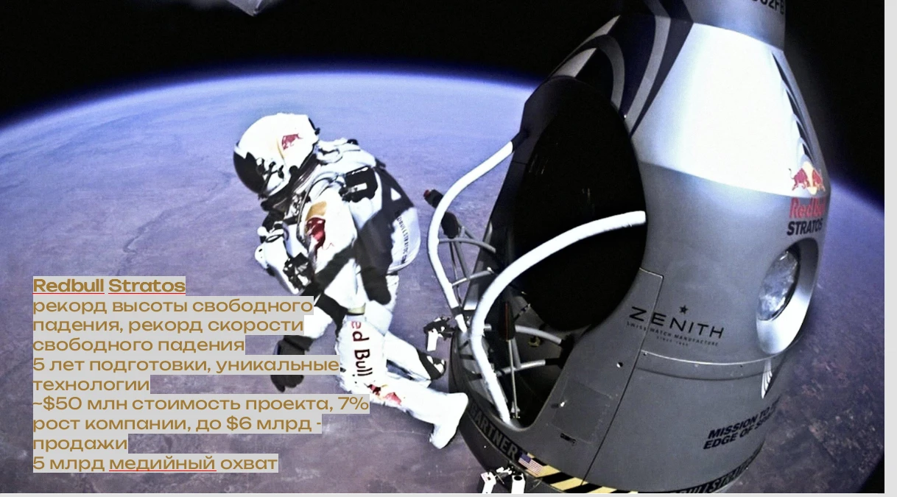

# Кейс · Red Bull — от напитка к индустрии экстрима

> **Страница кейса:** [`index.html`](index.html) · **слайды для показа:** [`slides.html`](slides.html).
> Страница собирается из этого файла и тезисов: `python theses/site/build.py`.

Кейс дисциплины [«Технологии (ИСЭиФ)»](../../README.md), блоки `transition` и `ai-business`. Кейс —
**сборка над тезисами** ([модель слоя](../../../../theses/README.md)): содержание — слайды, комментарии,
вопросы, что проверить — живёт в тезисах, а здесь — то, что относится к компании целиком: паспорт,
досье, маршрут заданий, исходные слайды автора и цикл обновления.

| Поле | Значение |
|---|---|
| Компания | Red Bull (напитки / спорт-медиа) |
| Уровень по рамке | **Уровень 3: постинформационный уклад, «хлопушка»** |
| Каталог | [`bm01`](../../catalog/business-models.csv) (модель бизнеса) · [`ca08`](../../catalog/cases.csv) (Red Bull Stratos) |
| Рамка | Три уклада (`m01`) · воронка · лейка · хлопушка (`c01`) · ключевой переход (`c19`) · культурный дизрапт (`c23`) · правило трёх доменов (`m02`) |
| Где разбирается | Тема [`t19`](../../catalog/topics.csv) «Кейсы трансформации моделей бизнеса»; семинар — вопрос [`q17`](../../catalog/questions.csv) |
| Живое досье | [`assignments/dossiers/red-bull/`](../../../../assignments/dossiers/red-bull/README.md), стадия «зерно», v0.1 |
| Серии | [«Постинформационные модели бизнеса»](../../../../theses/assemblies/pim-business-models.md) |

## Тезисы

1. `th01` [Модель бизнеса Red Bull](../../../../theses/th01-red-bull-model/README.md): три уклада,
   формула-цикл и ключевой переход, Red Bull Stratos.

## Цифры и статус проверки

Все цифры кейса взяты со слайдов автора и по первоисточникам не проверены. Список утверждений, что
именно уточнить и статус — в карточке тезиса, раздел
[«Что проверить»](../../../../theses/th01-red-bull-model/README.md#что-проверить). Проверка — часть
задания `rb-02` и доски пробелов досье.

## Вопросы для семинара

Вопросы — в карточке тезиса, раздел
[«Вопросы»](../../../../theses/th01-red-bull-model/README.md#вопросы). Главный — разобрать кейс по трём
укладам и сформулировать ключевой переход ([`q17`](../../catalog/questions.csv)).

## Задания

| Задание | Синопсис | Результат |
|---|---|---|
| **[`rb-02` Бизнес-модель Red Bull по трём укладам](../../../../assignments/templates/rb-02-red-bull-business-model.md)** | Превратить тезисы слайдов в проверенную модель: проверить каждое утверждение по первоисточникам, разложить компанию по трём укладам и четырём срезам, найти, что изменилось с момента слайдов | Модель в досье (v1) + хроника ≥ 10 событий + разбор на 3–5 страниц |
| [`tpl07` Stratos как хлопушка](../../../../assignments/site/index.html) | Разобрать Stratos по модели «воронка · лейка · хлопушка» | Разбор на 1–2 страницы |
| [Маршрут досье](../../../../assignments/dossiers/red-bull/README.md#маршрут-заданий) | Оппонирование, ставка «следующая хлопушка», переопыление на спортивные воркстримы, дашборд | По стадии досье |

Задания эстафетные: каждый следующий участник получает редакцию задания по текущему состоянию досье
([модель слоя заданий](../../../../assignments/README.md)). Все задания — в
[архиве заданий](../../../../assignments/site/index.html).

## Слайды

Исходные слайды автора — первоисточник тезисов кейса. **Они регулярно обновляются**: новая версия
кладётся под тем же именем файла, дата обновляется в таблице, а тезис `th01` сверяется с новой версией.
Ссылки со страницы кейса и из задания при этом не ломаются.

| Файл | Что на слайде | Дек-источник | Обновлён |
|---|---|---|---|
| [`slides/red-bull-three-uklads.png`](slides/red-bull-three-uklads.png) | Red Bull по трём укладам, формула, ключевой переход | *уточнить*: `s-digital` / `s-ingos-transform` / `s-frontier-21-01` ([`sources.csv`](../../catalog/sources.csv)) | 2026-10-07 |
| [`slides/red-bull-stratos.webp`](slides/red-bull-stratos.webp) | Red Bull Stratos: рекорды, стоимость, эффект, охват | *уточнить*: `s-ingos-transform` / `s-frontier-21-01` | 2026-10-07 |




## Как кейс обновляется

```
слайды автора (новая версия) ──► тезис th01 ──► страница кейса · серии · редакция задания rb-02
        ▲                                                  │
        └──── досье дозрело до «кейса» ◄──── работы студентов (PR в досье)
```

Когда досье доходит до стадии «кейс» (модель проверена и выдержала оппонирование), проверенные цифры и
выводы переносятся в тезис `th01` и в строку каталога `bm01`: подсветка «проверить» снимается, страница
кейса пересобирается сама.

## Источники

- Хан Д. Авторские презентации курса (деки `s-digital`, `s-ingos-transform`, `s-frontier-21-01`),
  2025–2026. Приватные; слайды кейса — в [`slides/`](slides/) (версия 2026-10-07, первая версия —
  дата обращения 2026-09-30).
- Первоисточники по компании — собираются в [`sources.csv` досье](../../../../assignments/dossiers/red-bull/sources.csv).

Рамка авторская (Д. Хан). Кейс собран с помощью ИИ-ассистента по слайдам автора и требует ревью
([`rules/ai-usage.md`](../../../../rules/ai-usage.md)).
